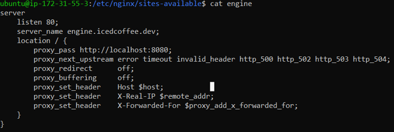

# Deployment Guide
## On own computer
1. Navigate to engine folder in repository
2. Command: `mvn package`
3. Copy produced .jar file to chosen server
## On Server
1. Install nginx following instructions at https://www.nginx.com/resources/wiki/start/topics/tutorials/install/
2. Command: `cd /etc/nginx/sites-available`
3. Create config file called engine in format as per image  
4. Install certbot following instructions at https://certbot.eff.org/lets-encrypt/ubuntubionic-nginx
5. Command: `java -jar engine.jar`
6. Navigate to domain name/IP and application should be there
